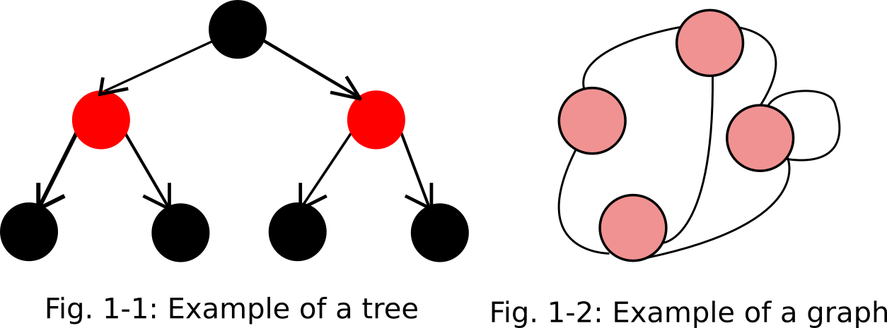

# CS Data Structures Assessment #2 (Part 1)

This markdown file contains my responses to this weekend's discussion questions.

## Recursion

1. Recursion is the process of calling a function inside itself. A recursive function always has three key components: a base case (a degenerative case that has certain target characteristics), some form of progress (such as adding, appending to a list, and so on), and a recursive call. A recursive function will continue calling itself until it reaches the base case.
2. A base case is necessary in recursion because the base case tells the recursive function when to stop recursing. For instance, when writing a recursive function that implements a merge sort, the base case is a list of length 1. A list of length 1 is always sorted, which is the state you want to be in at the end of the merge sort. Once the function hits a list of length 1, it can start composing longer sorted lists.

## Graphs

1. A graph is a collection of nodes connected by arcs that (usually) demonstrate meaningful relationships.
2. Graphs differ from trees in three ways. First, graphs can have *cycles*--that is, nodes can connect back to earlier nodes in the graph directly, or even to themselves. Graphs can also be *undirected*, which means that when traversing the graph, you can travel both forward and backward; trees are directed, meaning you can only go one way. Finally, trees usually indicate some sort of hierarchy, while a graph usually just shows connections. The two images below are a tree and a graph, respectively. 



3. You could model an ecosystem's food chain as a graph, where animals are connected to animals they eat by directed arcs. You could also model a map of cities as a graph. The roads between those cities, or perhaps the flight paths, would be arcs; I believe the traveling salesman problem represents the salesman's route as a graph, for example.

## Performance of Different Data Structures
*Question: Fill in the runtimes for the following actions for the table below.* (My answers are in bold, and my reasoning follows the table.)

| Data Structure                | Index  |Search  | Add-R  | Add-L  | Pop-L  | Pop-R  |
| -------------                 |------- | :----- |:-----: |------: |------: |------: |
|Python List (Array)            |O(1)    |O(n)	  |O(1)	   |**O(n)**|**O(n)**|**O(1)**|
|Linked List	 	            |**O(n)**|**O(n)**|**O(1)**|**O(1)**|**O(1)**|**O(n)**|
|Doubly-Linked List             |**O(n)**|**O(n)**|**O(1)**|**O(1)**|**O(1)**|**O(1)**|
|Queue (as Array)	            |X	    |X	      |**O(1)**|X       |**O(n)**|X       |
|Queue (as LL or DLL)           |X	    |X	      |**O(1)**|X	    |**O(1)**|X       |
|Stack (as Array, LL, or DLL)   |X      |X    	  |**O(1)**|X	    |X       |**O(1)**| 
|Deque (as DLL)                 |X	    |X	      |**O(1)**|**O(1)**|**O(1)**|**O(1)**| 

1. **Python List(Array)**: When you add to or pop from the beginning of a Python List, Python has to touch every value in the list. When adding, every list item gets shifted right by one index to make space; when popping, every item gets shifted left one index. Popping from the end of a Python list means deleting the item at the last index. Reaching that item is just a matter of performing a multiplication operation to find the correct address to clear out.
2. **Linked List**: To get an item in a linked list by index, you'd have to traverse the list and keep track of how many nodes you've seen, because linked lists don't typically track indexes. In the worst case, to get the last item in the list, you'd have to traverse the whole thing. The same goes for searching a linked list. As long as you're tracking the tail, adding an element to the right side of a linked list should only involve pointing the tail at the new element and pointing the previous tail's `next` value to the new element, making this action O(1). Adding to the left of a linked list that tracks its head involves a similar number of actions, but you're working with the head instead of the tail. Popping from the left is very similar to adding if you're tracking the head. Unfornutately, popping from the right requires touching every item in the list. You have to point the new tail's `next` property at `None`, but you can't do that without first finding the new tail.
3. **Doubly-Linked List**: A doubly-linked list should have all of the same runtimes as a linked list, except popping from the right is much easier. Since nodes in a DLL track the parent, the tail you're popping knows which node came before it. You can just grab the previous node and point its `next` property at `None` without traversing the whole list.
4. **Queue (Array)**: Queuing should be O(1), since adding an element to the right side of an array is O(1). Dequeuing should be O(n), since popping from the left side of an array is O(n).
5. **Queue(as LL or DLL)**: As a linked or doubly-linked list, a queue gains the runtime improvements those data structures. The runtime for adding to the right should stay O(1), but popping from the left should improve to O(1).
6. **Stack (Array/LL/DLL)**: Regardless of which of these three implementation options a stack uses, adding to the right should be O(1), because that's the runtime complexity for that action across all three. Popping from the "right" can be O(1) for all three, depending on what you consider the "top" of the stack. In an array, if you treat the end of the array as the top (which you should, if you push to the end), then the runtime complexity of popping from the right is O(1). In a LL, if you consider the "right" side of the stack to be the head of the linked list (left in the table above), then popping from the right of the stack is also O(1). For a DLL-based stack, it doesn't matter whether the head or the tail of the list is the top of the stack; popping from the top should be O(1).
7. **Deque(as DLL)**: If a deque is implemented as a doubly-linked list, then it should have the same runtime complexity characteristics associated with a pure doubly-linked list.

*Question: Fill in the runtimes and memory requirements for the table below. Dictionary values are given.*(My answers are in bold, and my reasoning follows the table.)

| Data Structure           | Get    | Add    | Delete | Iterate| Memory |
| -------------            |------- | :----- |:-----: |------: |------: |
|Dictionary(Hash Map)      |O(1)    |O(1)	 |O(1)	  |O(n)    |medium  |
|Set (Hash Map)	 	       |**O(1)**|**O(1)**|**O(1)**|**O(1)**|**medium**|
|Binary Search Tree    |**O(log n)**|**O(n)**|**O(n)**|**O(1)**|**little**|
|Tree            	       |**O(n)**|**O(1)**|**O(1)**|**O(1)**|**little**|

1. **Set (Hash Map)**: A set is just a dictionary without keys, so it should have the same runtime complexity for these actions. The memory cost should scale the same, too.
2. **Binary Search Tree**: In a binary search tree, the nodes are organized such that you can throw away half the incorrect results every time you change to a different branch. That makes searching O(log n). At worst, adding an item to a binary search tree could be as much as O(n), because there's a chance that adding the item will force you to rebalance the tree. The same goes for deleting. Finding the next item should be O(1), since all items track their children. BSTs should take up relatively little memory, since you only have to store the nodes themselves; there's no need to allocate extra space.
3. **Tree**: For a tree, since there's no way to know roughly where an item should be positioned, getting an item out of it would be O(n) in the worst case. Assuming you actually have the node you want to delete or add already, then either option should be O(1). If you don't know where to put the node already or don't have the node to delete, you'd have tosearch for it, and that would make the add/delete processes O(n). Iterating should be O(1) because like a BST, a regular tree tracks its children. And trees should take up relatively little memory space, for the same reasons that apply to BSTs.

## Sorting #1: Describe Bubble Sort

A bubble sort iterates through a list of items and swaps the positions of any two numbers where the larger number is to the left. In this process, the biggest item "bubbles" to the end of the list. On each iteration, the next biggest number should bubble to the next biggest index. For example, take this list: 

```
[4, 2, 1, 3]
```

The first pass of the bubble sort would compare 4 and 2, find that 4 is larger, and swap them, for this list:

```
[2, 4, 1, 3]
```

The first pass would also swap 4 with 1:

```
[2, 1, 4, 3]
```

Before finally swapping 4 with 3:

```
[2, 1, 3, 4]
```

Assuming the sort is implemented recursively, a recursive call would happen here, and the algorithm would keep executing itself until no swaps were made. (This would be the base case.)

## Sorting #2: Describe Merge Sort

A merge sort ultimately takes two sorted lists and combines them into one big sorted list. It merges the lists by checking whether the next element in one list is larger than the next element in the other list and appending the smallest of the two to the final list, until there are no items left to check.

To actually reach the point where you have two sorted lists, merge sort splits the given list into two parts and recursively splits and merges the two parts until they're sorted.  The only way to know for certain that a list is sorted is if it contains just one item, so a single-item list is merge sort's base case.

Given the same list from before:

```
[4, 2, 1, 3]
```

A merge sort would first split this into two lists:

```
[4, 2]    [1, 3]
```

Then, the sort would split the first list into two lists:

```
[4]       [2]
```

Since both lists are now single-element lists, they can bem merged:

```
[2, 4]
```

Eventually, the recursive call on `[4, 2]` would finish, and `[1, 3]` would be sorted with merge sort. Once both lists are sorted, they'd be merged for one final sorted list.

## Sorting #3: Describe Quicksort

In a quicksort, you first pick an item in your unsorted list to act as a pivot. Then, you put all items less than the pivot to the left of the pivot and all items larger than the pivot to the right. Once all the items are in the right partitions, you can perform the same actions on the two partitions, and so on, recursively.

In a slightly modified version of the same list I've been using, say we pick 2 as the pivot.

```
[4, 1, 2, 3]
       ^
```

Now, we can place two markers down: One for the index where the pivot belongs (call it x), and one for a number we're currently looking at (call it y). These should start in the same place.

```
 x
 y
[4, 1, 2, 3]
       ^
```

At this point, quicksort would look at the first number. Since 4 is more than 2, x should continue to mark index 0, but y can move forward to index 1.

```
 x  y
 |  |
[4, 1, 2, 3]
       ^
```

1 is less than 2, so this item should be swapped with the item currently marked by x, and x should be incremented. The x marker indicates where the pivot belongs, so any time we place a number smaller than the pivot into that index, we know the pivot's home must be at least one index higher. The y marker should also be incremented as usual. Here's the new list:

```
    x  y
    |  |
[1, 4, 2, 3]
       ^
```

Now, y is pointing at the pivot! Just swap the pivot with the item at the index marked by x:

```
[1, 2, 4, 3]
    ^
```

And now, all items to the right of the pivot are greater than 2, and all items to the left of the pivot are less.

Now, we could pick a new pivot in one of the two slices of this list that don't contain the first pivot, and call quick sort again on just a slice, until the list is sorted.

## Git Branching

1. You'd probably want to use git branching when you have multiple developers working on a project. Coupled with code review before accepting pull requests in GitHub, this could help team members avoid breaking one another's code. Big companies that actually deploy code to users would also want to have a production/deploy branch and a development branch, to allow working code to be pushed to users while new features are built/tested separately.
2. A *pull request* is a way to ask a project owner to merge your branch with another branch of the project. You can make pull requests once you've created a branch, made changes, committed, and pushed those changes to your remote version of that branch. Once you submit a pull request on a project, someone with the power to accept pull requests should review your work and if all looks good, allow the merge to happen.